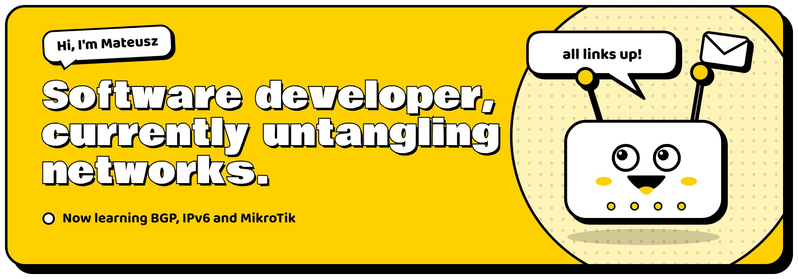
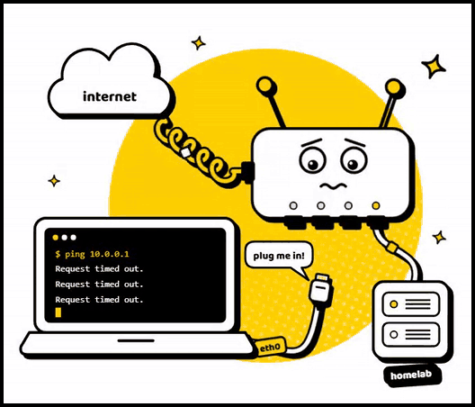
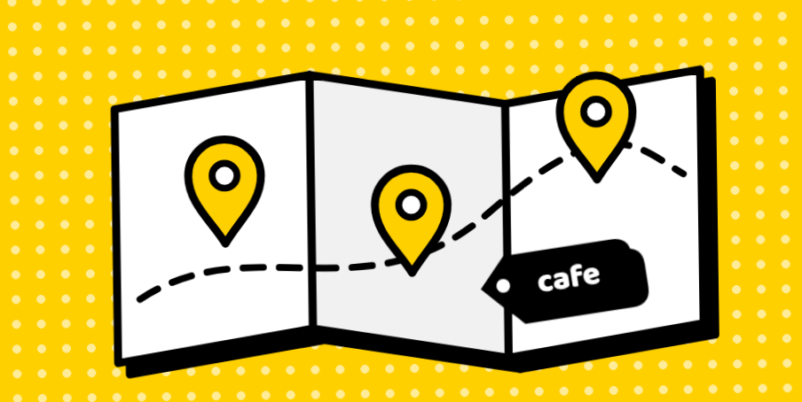
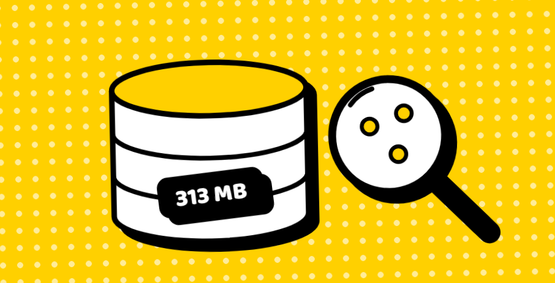
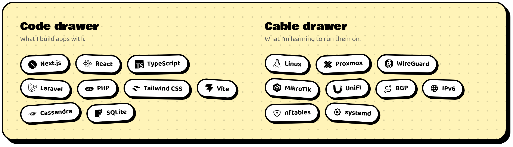

 

 

## About me

I build web apps with **Next.js**, **React** and **Laravel**. Lately I've been learning what runs underneath them: routing, BGP, WireGuard tunnels and a homelab that finds a new way to break every week.

- **Building:** web apps and the servers they run on
- **Learning:** BGP, IPv6 and MikroTik
- **Right now:** swapping my UniFi gateway for a MikroTik and learning RouterOS from scratch
- **Ask me about:** React, Next.js, Laravel, WireGuard, homelabs
- **Fun fact:** I'm a pro player in CS2

 

## Stuff I've built

Apps I wrote and still keep running. Each one taught me something about the servers underneath.

<table>
  <tr>
    <td width="40%"></td>
    <td>
      <h3>Places CRM</h3>
      An internal CRM for keeping track of places. Search pulls from OpenStreetMap and tags every result automatically, thumbnails are fetched and stored locally, and the admin panel creates WireGuard tunnels complete with a QR code.
        
      <code>Next.js 16</code> <code>React 19</code> <code>Cassandra</code> <code>WireGuard</code>
    </td>
  </tr>
  <tr>
    <td width="40%"></td>
    <td>
      <h3>Hosting dashboard</h3>
      A client panel for a hosting company. Two-factor sign-in, file storage on S3 and a versioned API that the rest of the platform talks to.
        
      <code>Laravel 13</code> <code>React</code> <code>Tailwind CSS</code>
    </td>
  </tr>
  <tr>
    <td width="40%"></td>
    <td>
      <h3>Local place search</h3>
      A place index built from Overture Maps in SQLite with full-text search. In my test it found 3.4 times more places than OpenStreetMap, and the whole thing fits in one 313 MB file.
        
      <code>SQLite</code> <code>FTS5</code> <code>Overture Maps</code>
    </td>
  </tr>
</table>

## Lessons from the lab

The networking side, in the order I learned it. Every one of these started with something not working.

| Level | What broke | What I did |
| :-- | :-- | :-- |
| **1. My first homelab** | Every reboot meant logging in and starting things by hand. | Each service got its own systemd unit, so the whole box comes back on its own. |
| **2. The MTU mystery** | New containers could ping anything, but HTTP requests just hung. | The packets were too big for the tunnel. MTU 1420 on the bridge and every page loaded. |
| **3. WireGuard only** | The tunnel worked from home and silently failed over LTE. | My upstream filters UDP on port 443. Moving WireGuard to 51820 fixed it. |
| **4. BGP over GRE** | I wanted my own IP addresses, but my router sits behind NAT. | A GRE tunnel to the provider, a BGP session inside it, and my own IPv4 and IPv6 space announced. |
| **5. A backup upstream** | One upstream meant one single point of failure for IPv6. | A second transit with AS-path prepending, so it only carries traffic when the first one is down. |
| **6. Next level: MikroTik**  in progress | My UniFi gateway hides too much of what it's doing. | Swapping it for a MikroTik and learning RouterOS from scratch. |

## Toolbox

 

### Got something to build? Send me a packet.

Need a web app built, or want to compare notes on a homelab? My inbox is open.

**[kontakt@mtomkiel.pl](mailto:kontakt@mtomkiel.pl)** · **[mtomkiel.pl](https://www.mtomkiel.pl)**

